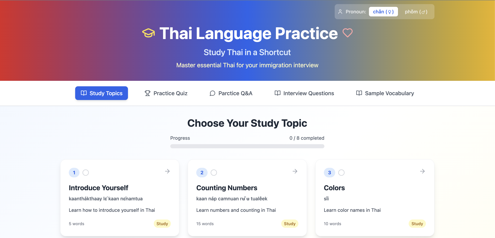
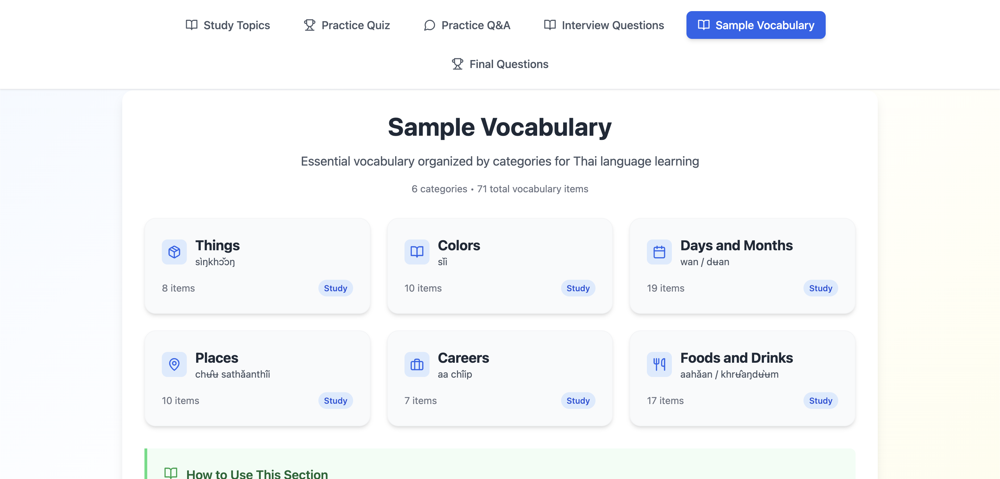

# 🎓 Thai Language Practice

> Master essential Thai for your Thai interview

A modern, interactive web application built with React, TypeScript, and Vite to help learners master essential Thai language skills through structured lessons, quizzes, and vocabulary practice.



## ✨ Features

### 📚 Study Topics
- **Introduce Yourself** - Learn basic self-introduction phrases (5 words)
- **Counting Numbers** - Master numbers and counting in Thai (15 words)
- **Colors** - Learn color names in Thai (10 words)
- Progress tracking for all study topics

### 🎯 Practice Quiz
Interactive quizzes to test your knowledge with:
- Multiple choice questions
- Audio pronunciation support
- Real-time progress tracking
- Questions from multiple topics (Counting Numbers, Colors, etc.)


### 💬 Practice Q&A
Conversational practice section for interview preparation

### 📋 Interview Questions
Curated list of common interview questions in Thai

### 📖 Sample Vocabulary
Comprehensive vocabulary organized by categories:
- **Things** (สิ่งของ) - 8 items
- **Colors** (สี) - 10 items
- **Days and Months** (วัน / เดือน) - 19 items
- **Places** (สถานที่) - 10 items
- **Careers** (อาชีพ) - 7 items
- **Foods and Drinks** (อาหาร / เครื่องดื่ม) - 17 items

**Total: 71 vocabulary items across 6 categories**



### 🔊 Audio Support
- Built-in pronunciation guide for Thai words
- Practice speaking feature for vocabulary

### 🌐 Pronoun Selection
Choose between formal pronouns:
- ชั้น (ฉ) - Informal "I"
- ผม (ผ) - Polite "I" (male)

## 🚀 Getting Started

### Prerequisites
- Node.js (v14 or higher)
- npm or yarn

### Installation

1. Clone the repository
```bash
git clone https://github.com/minthuzaw/learn-thai.git
cd learn-thai
```

2. Install dependencies
```bash
npm install
# or
yarn install
```

3. Start the development server
```bash
npm run dev
# or
yarn dev
```

4. Open your browser and navigate to `http://localhost:5173`

### Build for Production

```bash
npm run build
# or
yarn build
```

The built files will be in the `dist` directory.

## 🛠️ Tech Stack

- **React** - UI library
- **TypeScript** - Type-safe JavaScript
- **Vite** - Fast build tool and dev server
- **CSS3** - Styling with modern gradients and animations
- **React Router** - Client-side routing

## 📁 Project Structure

```
learn-thai/
├── src/
│   ├── components/     # React components
│   ├── pages/         # Page components
│   ├── data/          # Thai vocabulary and quiz data
│   ├── types/         # TypeScript type definitions
│   ├── utils/         # Helper functions
│   └── App.tsx        # Main app component
├── public/            # Static assets
├── screenshots/       # App screenshots for README
└── package.json
```

## 🎨 Design Features

- Modern gradient background (red → purple → blue)
- Responsive design for mobile and desktop
- Clean, intuitive user interface
- Progress indicators for learning tracking
- Interactive hover effects and animations

## 📱 Screenshots

### Home Page
Study topics with progress tracking and organized learning paths.

### Quiz Interface
Test your knowledge with interactive multiple-choice questions and instant feedback.

### Vocabulary Browser
Browse and study organized vocabulary by category with audio pronunciation.

## 🤝 Contributing

Contributions are welcome! Please feel free to submit a Pull Request.

1. Fork the repository
2. Create your feature branch (`git checkout -b feature/AmazingFeature`)
3. Commit your changes (`git commit -m 'Add some AmazingFeature'`)
4. Push to the branch (`git push origin feature/AmazingFeature`)
5. Open a Pull Request

## 📝 License

This project is open source and available under the [MIT License](LICENSE).

## 👨‍💻 Author

**Min Thu Zaw**
- GitHub: [@minthuzaw](https://github.com/minthuzaw)

## 🙏 Acknowledgments

- Thai language resources and native speakers for vocabulary verification
- Thai language interview preparation materials
- The React and Vite communities for excellent documentation

## 📧 Contact

For questions or feedback, please open an issue on GitHub or contact the repository owner.

---

Made with ❤️ for Thai language learners preparing for thai language interviews